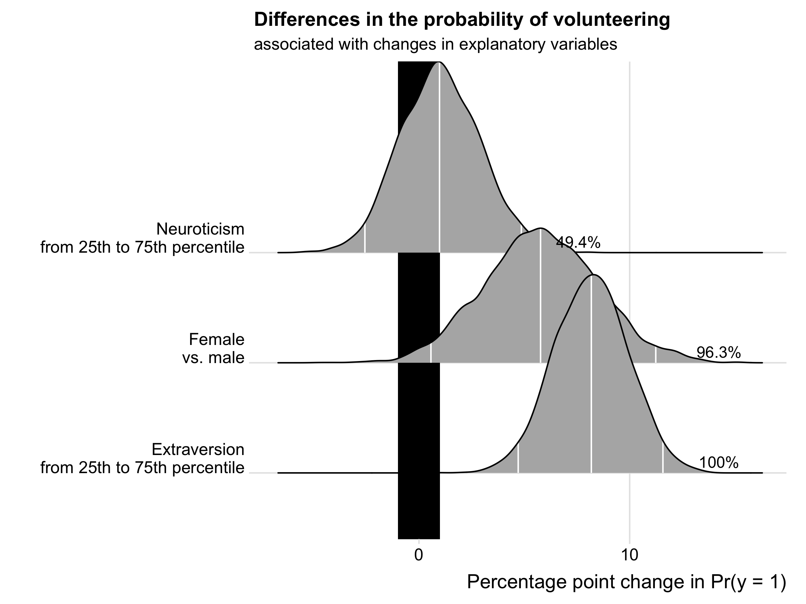

# Summary

BayesPostEst is an R [@R] package with functions to generate and present postestimation quantities after estimating Bayesian regression models fit using MCMC via JAGS [@jags2017], Stan [@rstan2019], MCMCpack [@MCMCpack], or other MCMC samplers. Quantities of interest include predicted probabilities and changes in probabilities in generalized linear models and analyses of model fit using ROC curves and precision-recall curves. The package also contains a function to create publication-ready tables summarizing model results with an assessment of substantively meaningful effect sizes.

The package contains six functions:

- `mcmcTab`: Summarize Bayesian MCMC Output
- `mcmcAveProb`: Predicted Probabilities using Bayesian MCMC estimates for the "Average" Case
- `mcmcObsProb`: Predicted Probabilities using Bayesian MCMC estimates for the Average of Observed Cases
- `mcmcFD`:  First Differences of a Bayesian Logit or Probit model
- `mcmcFDplot`:  Plot First Differences from MCMC output
- `mcmcRocPrc`:  ROC and Precision-Recall Curves using Bayesian MCMC estimates

# Statement of need and applications

A variety of existing packages offer outstanding functionalities to extract and visualize posterior distribution of estimates and some postestimation quantities (see last section of this paper). BayesPostEst implements methods for interpreting estimates in generalized linear models that are widely used in the social sciences. These methods are not currently available in this form and in one package. BayesPostEst also brings the "region of practical equivalence" [@Kruschke2013; Kruschke2018] to the widely used tool of calculating first differences after logit or probit models. Finally, BayesPostEst implements the popular model fit diagnostic of examining receiver-operating characteristic and precision-recall curves for Bayesian models.

<!-- # Installation

The released version of BayesPostEst can be installed from CRAN by using:

```{r}
install.packages("BayesPostEst")
```

Alternatively, the development version can be installed from Github:

```{r, eval = FALSE}
devtools::install_github("ShanaScogin/BayesPostEst")
```

# Vignette

The vignette for this package can be found using:

```{r}
vignette(package = "BayesPostEst")
```

and it is also posted on CRAN at <https://cran.r-project.org/package=BayesPostEst>.

# General setup

```{r}
library("BayesPostEst")
``` -->

# General setup

Most functions in BayesPostEst work with posterior distributions of parameters. These distributions need to be converted into a matrix. All functions in the package do this automatically for posterior draws generated by JAGS, BUGS, MCMCpack, rstan, and rstanarm. For posterior draws generated by other tools, users must convert these objects into a matrix, where rows represent iterations and columns represent parameters.

# Examples

## Running example data and model

This article uses the `Cowles` dataset [@CowlesDavis1987] from the carData package [@carData2018]. 

```{r}
df <- carData::Cowles
```

This data frame contains information on 1421 individuals in the following variables:

- volunteer: volunteeing, a factor with levels: no; yes. This is the outcome variable for the running example in this vignette.
- neuroticism: scale from Eysenck personality inventory.
- extraversion: scale from Eysenck personality inventory.
- sex: a factor with levels: female; male.

We proceed with the example of a Bayesian generalized linear model with the inverse logit link function, where 

$$
Pr(\text{Volunteering}_i) = \text{logit}^{-1}(\beta_1 + \beta_2 \text{Female}_i +  \beta_3 \text{Neuroticism}_i + \beta_4 \text{Extraversion}_i)
$$

BayesPostEst functions accommodate GLM estimates for both logit and probit link functions. The examples proceed with the logit link function. If we had estimated a probit regression, the corresponding argument `link` in relevant function calls would need to be set to `link = "probit"`. Otherwise, it is set to `link = "logit"` by default.

For the purpose of this article, we proceed by estimating the model using the rstanarm interface [@rstanarm2019], though users can also access all functions after estimating the same model in JAGS [@jags2017], MCMCpack [@MCMCpack], rstan [@rstan2019], or other tools. See the package vignette for more details.

```{r}
library("rstanarm")
fit <- stan_glm(volunteer ~ female + neuroticism + extraversion, 
                          data = df, family = binomial(link = "logit"),
                         prior = normal(0, 3),
                         prior_intercept = normal(0, 3),
                         chains = 4, 
                         iter = 2000,
                         seed = 123)
```

## Summary table

`mcmcTab` generates a table summarizing the posterior distributions of all parameters contained in the model object. This table can then be used to summarize parameter quantities. By default, `mcmcTab` generates a dataframe with one row per parameter and columns containing the median, standard deviation, and 95% credible interval of each parameter's posterior distribution. Users can add a column to the table that calculates the percent of posterior draws that have the same sign as the median of the posterior distribution. 

```{r}
mcmcTab(fit, Pr = TRUE)
```

```
##       Variable Median    SD  Lower  Upper    Pr
## 1  (Intercept) -0.458 0.081 -0.623 -0.306 1.000
## 2       female  0.237 0.111  0.023  0.462 0.986
## 3  neuroticism  0.055 0.108 -0.144  0.276 0.704
## 4 extraversion  0.518 0.112  0.296  0.733 1.000
```

Users can also define a "region of practical equivalence" [ROPE, see @Kruschke2013; Kruschke2018]. This region is a band of values around 0 that are "practically equivalent" to 0 or no effect. For this to be useful, all parameters (e.g. regression coefficients) must be on the same scale because `mcmcTab` accepts only one definition of ROPE for all parameters. Users can standardize regression coefficients to achieve this. Because we standardized variables earlier, the coefficients (except the intercept) are on a similar scale and we define the ROPE to be between -0.1 and 0.1.

```{r}
mcmcTab(fit, pars = c("female", "neuroticism", "extraversion"), ROPE = c(-0.1, 0.1))
```

```
## This table contains an estimate for parameter values outside of the region of 
##           practical equivalence (ROPE). For this quantity to be meaningful, all parameters 
##           must be on the same scale (e.g. standardized coefficients or first differences).
##       Variable Median    SD  Lower Upper PrOutROPE
## 1       female  0.237 0.111  0.023 0.462     0.886
## 2  neuroticism  0.055 0.108 -0.144 0.276     0.342
## 3 extraversion  0.518 0.112  0.296 0.733     1.000
```

## Predicted probabilities

### For "typical" cases

To evaluate the relationship between covariates and a binary outcome, this function calculates the predicted probability ($Pr(y = 1)$) at pre-defined values of one covariate of interest ($x$), while all other covariates are held at a "typical" value. This follows suggestions outlined in @KingEtal2000 and elsewhere, which are commonly adopted by users of GLMs. The `mcmcAveProb` function by default calculates the median value of all covariates other than $x$ as "typical" values. 

Before moving on, we create a matrix of posterior draws of coefficients to pass onto these functions. 

```{r}
mcmcmat <- as.matrix(fit)
```

Next, we generate the model matrix to pass on to the function. A model matrix contains as many columns as estimated regression coefficients. The first column is a vector of 1s (corresponding to the intercept); the remaining columns are the observed values of covariates in the model. **Note: the order of columns in the model matrix must correspond to the order of columns in the matrix of posterior draws.**

```{r}
mm <- model.matrix(volunteer ~ female + neuroticism + extraversion,
                   data = df)
```

### Comparing predicted probabilities for binary explanatory variables

The code below generates full posterior distributions of the predicted probability of volunteering for a typical female and a typical male. In this function and `mcmcObsProb`, users specify the range of $x$ (here 0 and 1) as well as the number of the column of $x$ in the matrix of posterior draws as well as the model matrix. 

```{r}
aveprob.female <- mcmcAveProb(modelmatrix = mm,
            mcmcout = mcmcmat[, 1:ncol(mm)],
            xcol = 2,
            xrange = c(0, 1),
            link = "logit",
            ci = c(0.025, 0.975),
            fullsims = TRUE)
head(aveprob.female)
```

```
##   Iteration x        pp
## 1         1 0 0.3811080
## 2         2 0 0.4019670
## 3         3 0 0.3911026
## 4         4 0 0.4056572
## 5         5 0 0.4101353
## 6         6 0 0.3800479
```

### Comparing predicted probabilities for continuous explanatory variables

For continuous variables of interest, users may want to set `fullsims = FALSE` to obtain the median predicted probability along the range of $x$ as well as a lower and upper bound of choice (here, the 95% credible interval). 

```{r}
aveprob.extra <- mcmcAveProb(modelmatrix = mm,
            mcmcout = mcmcmat[, 1:ncol(mm)],
            xcol = 4,
            xrange = seq(min(df$extraversion), max(df$extraversion), length.out = 20),
            link = "logit",
            ci = c(0.025, 0.975),
            fullsims = FALSE)
head(aveprob.extra)          
```

```
## # A tibble: 6 x 4
##        x median_pp lower_pp upper_pp
##    <dbl>     <dbl>    <dbl>    <dbl>
## 1 -1.33      0.287    0.221    0.358
## 2 -1.19      0.302    0.239    0.369
## 3 -1.05      0.317    0.257    0.379
## 4 -0.906     0.334    0.277    0.390
## 5 -0.764     0.350    0.297    0.402
## 6 -0.622     0.367    0.318    0.415
```

Users can then visualize the posterior distribution (for the binary predictor gender) and the median and credibility interval of probability across the range of extraversion:


### Average effects across observed cases

As an alternative to probabilities for "typical" cases, @HanmerKalkan2013 suggest to calculate predicted probabilities for all observed cases and then derive an "average effect". In their words, the goal of this postestimation "is to obtain an estimate of the average effect in the population ... rather than seeking to understand the effect for the average case." BayesPostEst allows users to calculate these quantities for binary and continuous predictors. Akin to the previous example, users can then plot full posterior densities or median probabilities with a credible interval.


## First differences

To summarize typical effects across covariates, users can generate "first differences" [@Long1997; @KingEtal2000]. This quantity represents, for each covariate, the difference in predicted probabilities for cases with low and high values of the respective covariate. For each of these differences, all other variables are held constant at their median. Users can directly obtain a summary when setting `fullsims` to FALSE.

```{r}
fdsum <- mcmcFD(modelmatrix = mm,
                  mcmcout = mcmcmat[, 1:ncol(mm)],
                  link = "logit",
                  ci = c(0.025, 0.975),
                  fullsims = FALSE)
fdsum
```

```
##                median_fd    lower_fd   upper_fd      VarName VarID
## female       0.057704351  0.00568767 0.11238107       female     1
## neuroticism  0.009760613 -0.02565700 0.04858694  neuroticism     2
## extraversion 0.081800299  0.04709179 0.11578069 extraversion     3
```

Users can also generate the full posterior distribution of these first differences.

```{r}
fdfull <- mcmcFD(modelmatrix = mm,
                  mcmcout = mcmcmat[, 1:ncol(mm)],
                  link = "logit",
                  ci = c(0.025, 0.975),
                  fullsims = TRUE)
summary(fdfull)
```

```
##     female          neuroticism         extraversion     
## Min.   :-0.04677   Min.   :-0.055942   Min.   :0.009379  
## 1st Qu.: 0.03996   1st Qu.:-0.003178   1st Qu.:0.069341  
## Median : 0.05770   Median : 0.009761   Median :0.081800  
## Mean   : 0.05797   Mean   : 0.010268   Mean   :0.081663  
## 3rd Qu.: 0.07617   3rd Qu.: 0.023238   3rd Qu.:0.093533  
## Max.   : 0.15202   Max.   : 0.081202   Max.   :0.136574  
```

To make use of the full posterior distribution of first differences, BayesPostEst provides a dedicated plotting function. `mcmcFDplot` returns a ggplot2 object that can be further customized. The function is modeled after Figure 1 in @Karreth2018. Users can specify a region of practical equivalence and print the percent of posterior draws to the right or left of the ROPE. If ROPE is not specified, the figure automatically prints the percent of posterior draws to the left or right of 0.


```{r}
p <- mcmcFDplot(fdfull = fdfull, ROPE = c(-0.01, 0.01))
p <- p + labs(title = "First differences") + ggridges::theme_ridges()
```



# Model fit analyses using ROC and Precision-Recall curves

One way to assess model fit is to calculate the area under the Receiver Operating Characteristic (ROC) and Precision-Recall curves. A short description of these curves and their utility for model assessment is provided in @Beger2016. The `mcmcRocPrc` function produces an object with four elements: the area under the ROC curve, the area under the PR curve, and two dataframes to plot each curve. When `fullsims` is set to `FALSE`, the elements represent the median of the posterior distribution of each quantity.

Because each of these measures relies on comparing the observed $y$ to $Pr(y = 1)$, the function requires both the posterior distribution of all regression coefficients as well as a model frame. This model frame contains all variables used to estimate the model, with the outcome variable in the first column and all other variables following thereafter.

```{r}
mf <- model.frame(volunteer ~ female + neuroticism + extraversion, data = df)
fitstats <- mcmcRocPrc(modelmatrix = mm,
                                mcmcout = mcmcmat[, 1:ncol(mm)],
                                modelframe = model.frame(fit),
                                curves = TRUE,
                                fullsims = FALSE)
```

Users can then print the area under the each curve:

```{r}
fitstats$area_under_roc
```

```
## [1] 0.5844961
```

```{r}
fitstats$area_under_prc
```

```
## [1] 0.4876175
```

Users can also plot the ROC curve as well as the precision-recall curve.


To plot the posterior distribution of the area under the curves, users set the `fullsims` argument to `TRUE`. Unless a user wishes to plot credible intervals around the ROC and PR curves themselves, we recommend keeping `curves` at `FALSE` to avoid long computation time. 

```{r}
fitstats.fullsims <- mcmcRocPrc(modelmatrix = mm,
                                modelframe = mf,
                                mcmcout = mcmcmat[, 1:ncol(mm)],
                                curves = FALSE,
                                link = "logit",
                                fullsims = TRUE)
```

Users can then plot the posterior density of the area under each curve.


# Comparison to other packages

The following packages provide functions similar (concretely or in spirit) to BayesPostEst:

- tidybayes [@tidybayes] offers a tidy workflow for extracting posterior distributions of estimates, fits, and predictions.
- bayesplot [@bayesplot] offers various plotting options for posterior quantities, including posterior predictive checks.
- bayestable [@bayestable] generates a regression table from MCMC estimates that can be passed on to the texreg package [@texreg]for printing.
- The sjstats [@sjstats] and sjPlot [@sjPlot] suite of packages allows for a variety of postestimation commands, including predicted probabilities, marginal effects, and a function to evaluate estimates in relationship to a user-defined ROPE.

# References